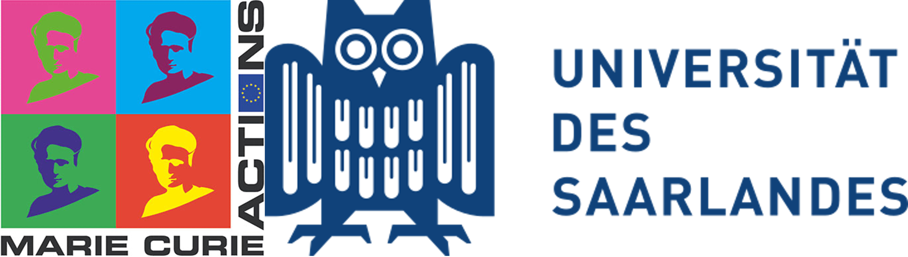

About Us
========

Project Origins
---------------

This project began during my Ph.D. studies at `Jochen Hub's Computational Biophysics Group <https://biophys.uni-saarland.de/>`__ at `Saarland University <https://www.uni-saarland.de/en/home.html>`__. It was carried out within the framework of the ITN (International Training Network) `PROTON <https://cordis.europa.eu/project/id/860592>`__ and in collaboration with the pharmaceutical company `Boehringer Ingelheim <https://www.boehringer-ingelheim.com/de/>`__. If you are interested in getting in touch or learning more about my work, please visit my `Portfolio <https://ale94mleon.github.io/>`__.

.. note::
   This project received funding from `Marie Skłodowska-Curie Actions <https://cordis.europa.eu/project/id/860592>`__.

|funding|

