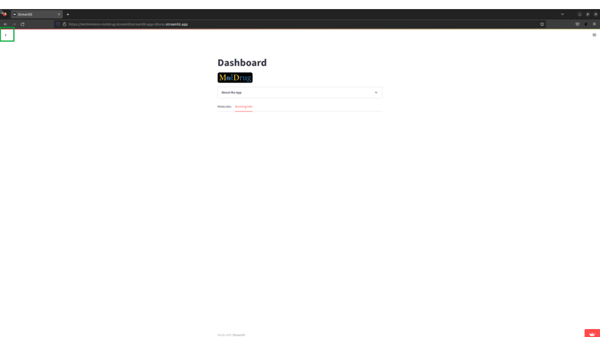
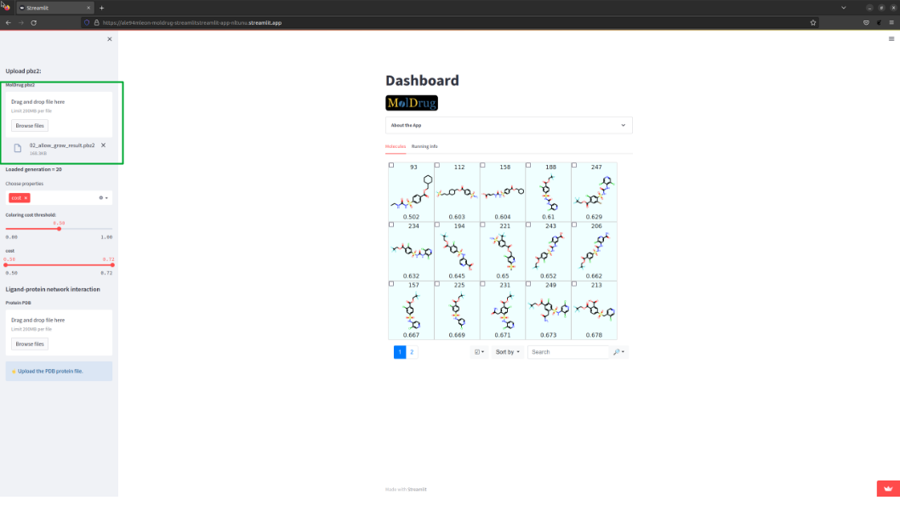
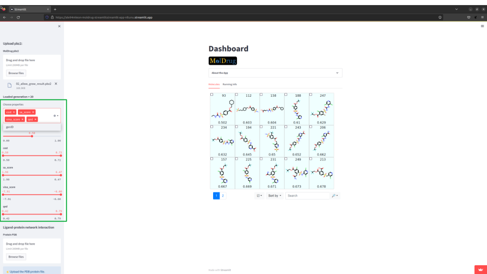
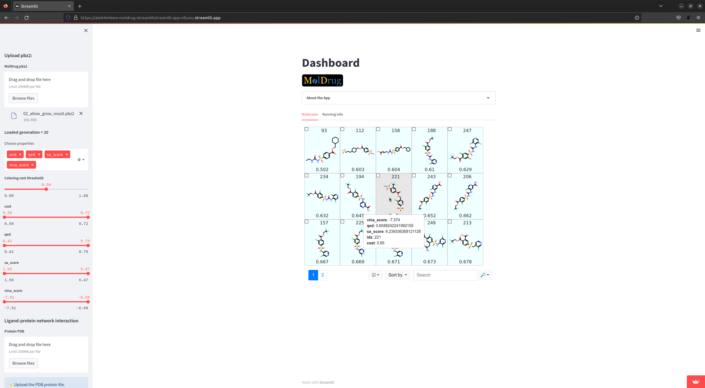
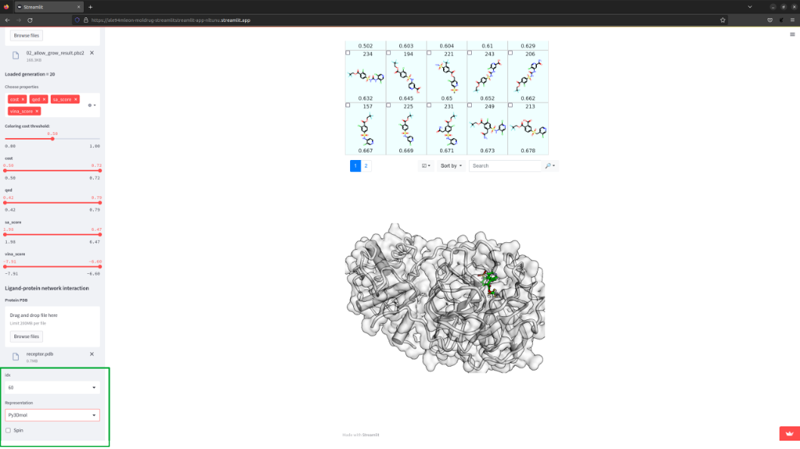
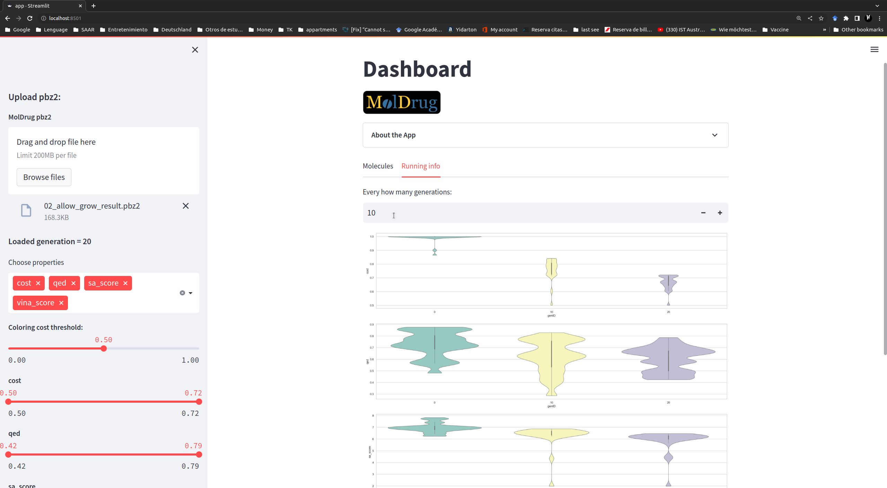

MolDrug Dashboard
=================

`MolDrug-Dashboard <https://ale94mleon-moldrug-streamlitstreamlit-app-nltunu.streamlit.app/>`__ will help you to get a overview 
of your MolDrug simulation. The inputs are:

#. ``pbz2`` file. Exported when the command line is used. This file can be generated calling the function ``moldrug.utils.compressed_pickle``. The class ``moldrug.utils.Local`` and ``moldrug.utils.GA`` has already this method implemented.   
#. ``pdb`` file. The protein PDB if you would like to check the Protein-Ligand interaction network.

Home
----
The app presents a side bar (on the left) where the filters and representation options are located. The outputs are presented
in the center of the app.
|01|

Upload pbz2
-----------
The first step is to upload the pbz2 file. As soon as it is done some new options pops up in the side bar and the table of molecules is presented.
|02|

Customizing filters and properties
----------------------------------
All the properties used during the MolDrug run will be shown in ``Choose properties`` and can be selected.
The slide bar filter could be used to only show specific molecules in the table.
|03|

Interacting with the molecule table
-----------------------------------
Play around with the options of the table. You can:

* Display the properties of the molecule (depending on the ``Choose properties``).
* Get more properties making click on the picture.
* Sort based on other property (by default ``cost``).
* Highlight substructure with the SMART filter.

|04| 
|05|

Ligand-protein network interaction. Upload pdb
----------------------------------------------
To access this feature you must upload the pdb file. You could interact with the ProLIF image.
To change the molecule, simply introduce ``idx`` (the number at the top of each molecule the picture in the table)
of the desired molecule. 
|06|

Get 3D view
-----------
You can change the default representation to a 3D vie selecting ``py3Dmol`` in ``Representation``
|07|

Running info
------------
On this tab you can find valuable information about the convergency of MolDrug. It is customizable based on:
``Choose properties`` and ``Every how many generations`` bottoms.
|08|

.. Screenshots

..  |05| image:: _static/dashboard/05.png
    :alt: 05
..  |06| image:: _static/dashboard/06.png
    :alt: 06

